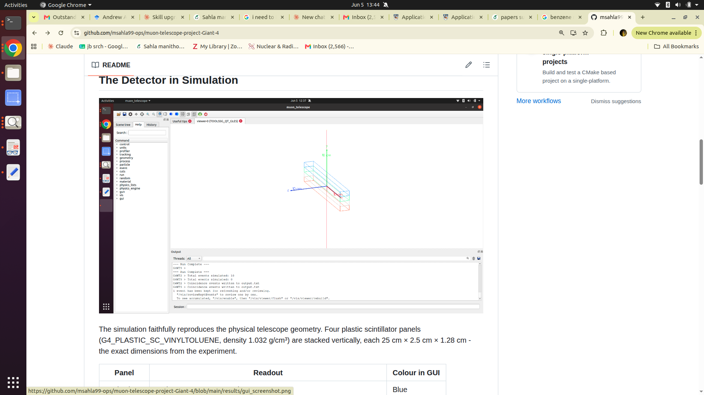
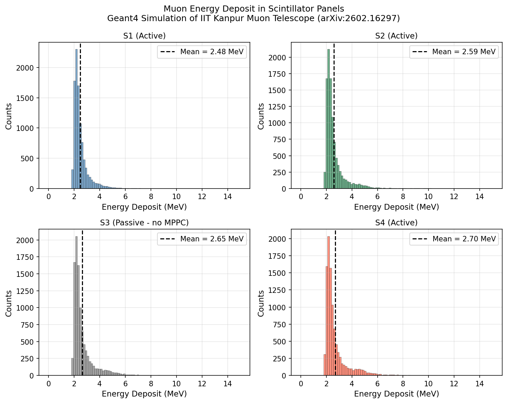

# Geant4 Simulation of MPPC-Scintillator Cosmic Muon Telescope

## The Experiment

During my research at IIT Kanpur, I built a four-panel plastic scintillator telescope to measure the angular distribution of cosmic muons at ground level. The telescope used Hamamatsu MPPCs coupled to BC-408 equivalent plastic scintillator bars via wavelength-shifting fibers, read out by a RIGOL oscilloscope with a three-fold coincidence trigger on panels S1, S2, and S4.

The experiment measured the cosmic muon flux as a function of zenith angle from 0° to 90°, fitted the angular distribution to cosⁿθ models, and extracted an angular exponent n = 1.44 ± 0.06.

The full experimental results are published at: **[arXiv:2602.16297](https://arxiv.org/abs/2602.16297)**

---

## Why This Simulation

The experimental analysis used the Bethe-Bloch MIP approximation — 2 MeV/(g/cm²) — to justify that 4 GeV cosmic muons would produce a clear, detectable signal in 1.28 cm thick plastic scintillator panels. This simulation independently verifies that claim using the full Bethe-Bloch electromagnetic physics implemented in Geant4.

Rather than using the approximation, Geant4 calculates the muon energy loss step by step through the exact detector geometry — accounting for ionisation, delta ray production, and multiple scattering — and produces the complete energy deposit distribution per panel.

---

## The Detector in Simulation



The simulation faithfully reproduces the physical telescope geometry. Four plastic scintillator panels (G4_PLASTIC_SC_VINYLTOLUENE, density 1.032 g/cm³) are stacked vertically, each 25 cm × 2.5 cm × 1.28 cm — the exact dimensions from the experiment.

| Panel | Readout | Colour in GUI |
|-------|---------|---------------|
| S1 (top) | Active — MPPC connected | Blue |
| S2 | Active — MPPC connected | Green |
| S3 | Passive — no MPPC (oscilloscope channel used for coincidence logic) | Grey |
| S4 (bottom) | Active — MPPC connected | Red |

S3 had no MPPC in the real experiment because the fourth oscilloscope channel was needed for coincidence triggering. It is included in the simulation geometry because the muon physically passes through it and loses energy there — omitting it would give an incorrect energy deposit in S4.

Muons are fired vertically downward at 4 GeV kinetic energy — the mean energy of cosmic muons at sea level (PDG 2022, confirmed in arXiv:2602.16297). The triple coincidence condition S1 AND S2 AND S4 mirrors the experimental trigger.

---

## Results



Running 10,000 muon events produces the energy deposit distributions shown above. All four panels show the characteristic **Landau distribution** — a sharp peak around 2--3 MeV from minimum ionising muons, with a long tail at higher energies from delta ray electrons produced along the muon track.

| Panel | Simulated Mean | Bethe-Bloch Approximation |
|-------|---------------|--------------------------|
| S1 | 2.48 MeV | 2.64 MeV |
| S2 | 2.59 MeV | 2.64 MeV |
| S3 | 2.65 MeV | 2.64 MeV |
| S4 | 2.70 MeV | 2.64 MeV |

The Bethe-Bloch MIP approximation predicts: 2 MeV/(g/cm²) × 1.032 g/cm³ × 1.28 cm = **2.64 MeV** per panel. The Geant4 full-formula results are consistent with this prediction, confirming that the MIP approximation used in the experimental analysis is physically well-justified.

The slight increase in mean energy deposit from S1 to S4 (2.48 → 2.70 MeV) is physically correct — the muon loses a small amount of energy traversing the stack, and a slower muon deposits slightly more energy per centimetre, as described by the Bethe-Bloch formula. This effect is correctly captured by Geant4's step-by-step tracking.

---

## How to Build and Run

### Requirements
- Geant4 11.x (compiled with Qt and OpenGL support)
- CMake 3.16+
- Python 3 with numpy and matplotlib

### Compile
```bash
source ~/geant4-install/bin/geant4.sh
mkdir build && cd build
cmake .. && make -j4
```

### Run with GUI (visualise detector and muon tracks)
```bash
cd ~/muon_telescope
./build/muon_telescope
# At Session prompt type:
/control/execute vis.mac
```

### Run batch mode (10000 muons)
```bash
./build/muon_telescope
# At Session prompt type:
/run/beamOn 10000
```

### Analyse output
```bash
python3 analysis.py
```

Output is written to `build/output.txt` — one row per coincidence event with energy deposits in S1, S2, S3, S4 in MeV.

---

## File Structure
muon_telescope/
├── CMakeLists.txt
├── muon_telescope.cc
├── vis.mac
├── analysis.py
├── include/
│   ├── DetectorConstruction.hh
│   ├── PhysicsList.hh
│   ├── PrimaryGeneratorAction.hh
│   ├── SteppingAction.hh
│   ├── EventAction.hh
│   ├── RunAction.hh
│   └── ActionInitialization.hh
├── src/
│   ├── DetectorConstruction.cc
│   ├── PhysicsList.cc
│   ├── PrimaryGeneratorAction.cc
│   ├── SteppingAction.cc
│   ├── EventAction.cc
│   ├── RunAction.cc
│   └── ActionInitialization.cc
└── results/
├── mip_peak.png
└── gui_screenshot.png
---

## Future Work

Full optical photon simulation using Geant4's G4Scintillation, G4OpWLS, and G4OpBoundaryProcess to model scintillation light production, WLS fiber collection efficiency, and MPPC photoelectron response — enabling direct comparison with the experimental 3 p.e. threshold.

---

## Environment

- Geant4 11.2.2, Ubuntu 20.04
- Independent computational work complementing the experimental results of arXiv:2602.16297
